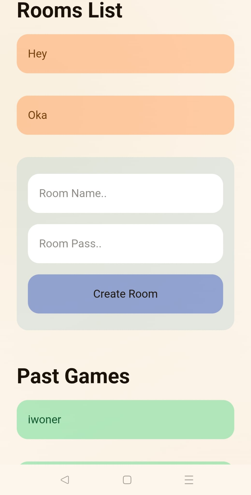
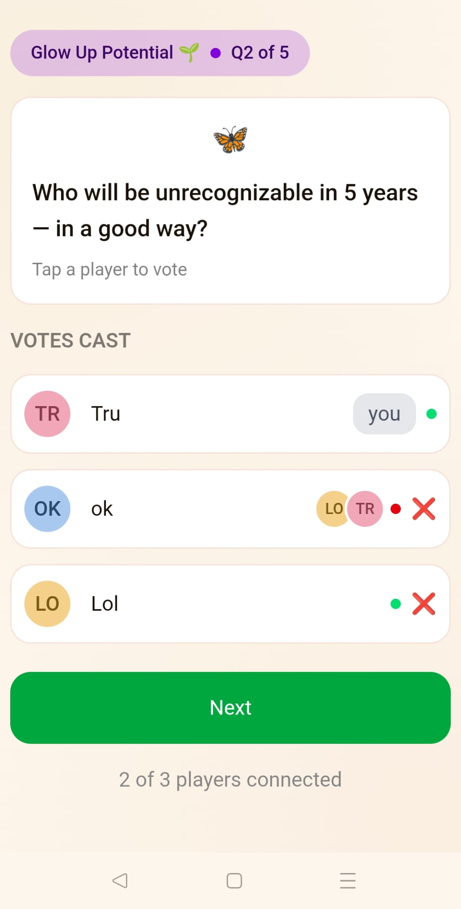
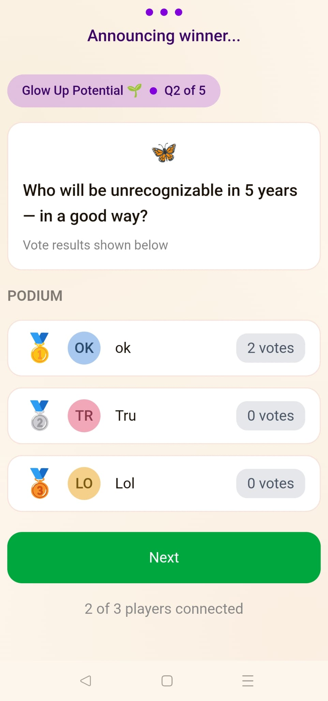
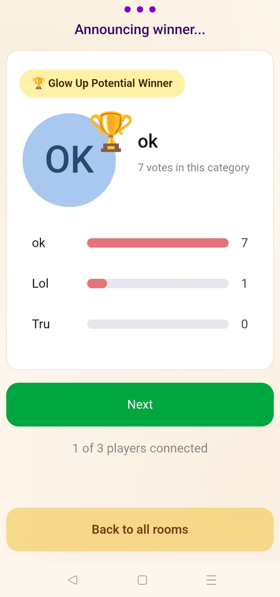

# Who's the friend
A fun game to play with a friend-roup






# Rules
* Random questions appear and everyone must vote for a player given that question.
* You cannot vote for yourself.
* Players with the highest vote count across all questions in a specific category win the category.
* The player with the highest vote count across all categories wins the game.

# Game Philosophy
The game is fun because of discussions. 
When you vote for a player, be ready to justify your vote or defend it. 
You can even compel others to vote the same because of your reasoning! 
The presence of winners is only there to create some tension for fun.
The game requires at-least 3 players to be playable and at-least 6 to be fun.

# Technicalities
* Every game has a game master.
* When you create a room, it is empty at first.
* The first player to join the room is automatically the game master. (Not necessarily the creator of the room!!)
* Only the game master can remove players.
* Only the game master can advance the game forward (Move on to next question, announce winners, etc..)

# Running the game locally
* All players must be connected on the same wifi-network as the computer
* NodeJS required.
* VitePlus required.

backend server:
```bash
cd ./backend/
npm install
node ./dist/src/index.js
```

frontend server
```bash
cd ./frontend/
vp install
vp dev -- --host
```
running this will give an output like:

  ➜  Local:   http://localhost:5173/
  ➜  Network: http://10.0.0.195:5173/
  ➜  Network: http://172.19.0.1:5173/
  ➜  Network: http://10.2.0.2:5173/
  ➜  press h + enter to show help

* One of the 'network' ip addresses is the one hosted on the wifi network.
* Find which one works through trial and error until the app shows up on the browser.
* All devices need to open that link.


# Development
* NodeJS required.
* VitePlus required.

## Initial setup (backend)
```
cd ./backend/
npm install
```

## Running the backend ts server
* You need this for any work on the backend for code changes to compile
```bash
npx tsc --watch
```
Keep this running for the entirety of your development session

## Running backend tests
```bash
npm run test
```
* Check the `./backend/tests/test.ts` and `./backend/tests/roomTest.ts` for examples on creating tests.

## Backend server:
```bash
npm run dev
```

## Initial setup (frontend)
```bash
cd ./frontend/
vp install
```

## Frontend server:
```bash
vp dev -- --host
```
